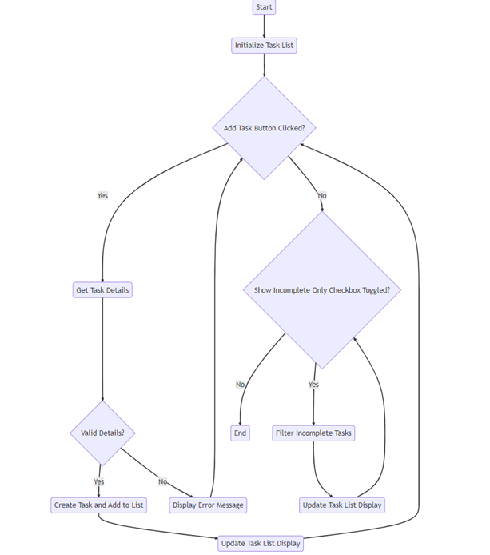

# Unit 16 Assignment 2

## Problem 1

## Design

### Definition statement

To do list

Users can add new tasks to the list by entering a title, description, and due date. The tasks are displayed in a list view, showing the title, description, due date, and completion status of each task. Users can mark tasks as complete or delete tasks from the list.

The application allows users to toggle between displaying all tasks or only incomplete tasks. Users can easily filter the task list to focus on the tasks that are yet to be completed.

When a task is selected from the task list, its details, including the title, description, due date, and completion status, are displayed in a separate section. Users can view the details of each task and mark tasks as complete if they are finished.

Key Features:

* Add Task - Users can add new tasks to the list by entering a title, description, and due date.

* Mark as Complete - Users can mark tasks as complete, indicating that they have been finished.

* Delete Task - Users can delete tasks from the list if they are no longer needed.

* Task Filtering - Users can toggle between displaying all tasks or only incomplete tasks.

* Task Details - The application provides a task details section that displays the title, description, due date, and completion status of the selected task.

### Data dictionary

Data Structures:
TaskItem Class: - Represents a single task item in the to-do list and represents additional details or description of the given task or tasks.The bool indicates whether the task is completed or not.
List<TaskItem>: - A collection that stores the task items and all task items that are added by the user are stored in this list.

Event Handlers:

* AddTaskButton_Click: Handles the click event when the user clicks the "Add Task" button to add a new task to the list.

* ToggleTasksButton_Click: Handles the click event when the user clicks the "Show Incomplete Tasks" button to toggle between displaying all tasks or only incomplete tasks.

* TaskListView_SelectionChanged: Handles the selection changed event when the user selects a task from the task list.

* DeleteTaskButton_Click: Handles the click event when the user clicks the "Delete Task" button to delete the selected task.

* CompleteTaskButton_Click: Handles the click event when the user clicks the "Complete Task" button to mark the selected task as complete.

### Flowchart

I have created a mermaid flowchart 

## Implementation

## Reveiw
